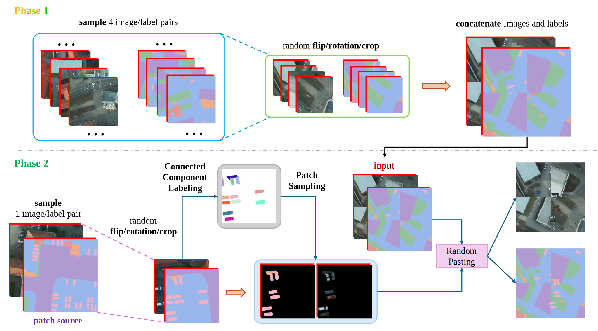
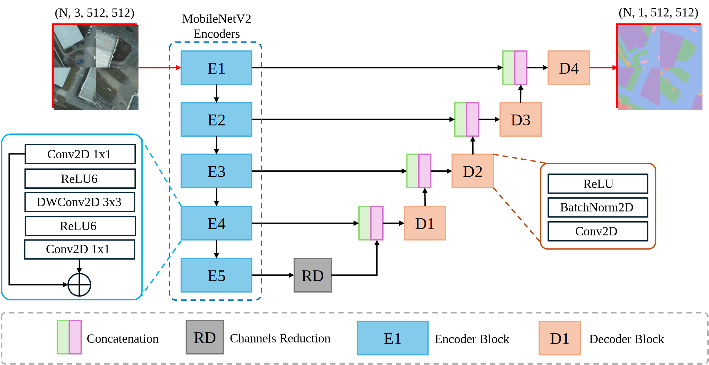

# CP2M: Clustered-Patch-Mixed Mosaic Augmentation for Aerial Image Segmentation


## 1. Summery

Remote sensing image segmentation is vital for earth observation but limited annotation data in remote sensing often leads to overfitting in deep learning models, driving research into data augmentation techniques. Many current approaches, however, rely on simple transformations that fail to enhance data diversity or model generalization effectively. Hence, We propose Clustered-Patch-Mixed Mosaic (CP2M), a novel augmentation strategy addressing these challenges. CP2M combines Mosaic augmentation, which merges four random samples, with a clustered patch mix phase leveraging connected component labeling to maintain spatial coherence and avoid irrelevant semantics. Experiments on the ISPRS Potsdam dataset show CP2M significantly reduces overfitting, achieving state-of-the-art segmentation accuracy and robustness for remote sensing tasks.


**Overall Pipeline**
The below Figure shows the overall pipeline for CP2M.


**Segmentation Model**
The figure below shows an example of how CP2M seamlessly integrates into some segmentation models like MobileNetV2-UNet. In this example, the MobileNetV2 encoder extracts multi-scale features through its hierarchical layers (E1–E5), which are then passed through a channel reduction module (RD) before being concatenated with the corresponding decoder outputs (D1–D4). CP2M augments the input samples fed to this architecture, enhancing data diversity while maintaining spatial coherence. By leveraging CP2M's Mosaic and clustered patch mix phases, the segmentation model achieves better generalization, reduced overfitting, and improved performance on tasks like aerial image analysis, as demonstrated in experiments with the ISPRS Potsdam dataset.



## 2. Dependencies

### 2.1 PaddlePaddle

For CUDA 12

```
python -m pip install paddlepaddle-gpu==2.6.2.post120 -i https://www.paddlepaddle.org.cn/packages/stable/cu120/
```

### 2.2 Others

```
pip install numpy pillow pandas matplotlib seaborn wandb tqdm albumentations
```

### 2.3 Dataset

The offical website of ISPRS-Potsdam is [link](https://www.isprs.org/education/benchmarks/UrbanSemLab/2d-sem-label-potsdam.aspx). You can download the data from [link](https://www.isprs.org/education/benchmarks/UrbanSemLab/default.aspx). Please place the data in `./dataset` following the structure:

```
.
├── Potsdam
│   ├── 2_Ortho_RGB
│   │   │── top_potsdam_4_12_RGB.tif
|   |   └── ...
│   └── 5_Labels_all
│       │── top_potsdam_4_12_label.tif
|       └── ...
└── README.md
```

Then please run `python make_potsdam_dataset.py` to generate the data for training and testing.

## 3. Usage

### 3.1 Train

```
usage: train.py [-h] [--img_path IMG_PATH] [--gt_path GT_PATH] [--percentage PERCENTAGE] [--epochs EPOCHS] [--batchsize BATCHSIZE] [--lr LR] [-aug]
                [--p_mosaic P_MOSAIC] [--p_cpm P_CPM] [--name NAME] [--key KEY] [--proj PROJ]

options:
  -h, --help            show this help message and exit
  --img_path IMG_PATH  
  --gt_path GT_PATH
  --percentage PERCENTAGE
  --epochs EPOCHS
  --batchsize BATCHSIZE
  --lr LR
  -aug
  --p_mosaic P_MOSAIC  # probability of applying MOSAIC augmentation
  --p_cpm P_CPM  # probability of applying CP2M augmentation
  --name NAME
  --key KEY
  --proj PROJ
```

**Train Using Default Setting**

```
python train.py --name <EXPPERIMENT NAME> --key <YOUR WANDB KEY> -aug
```

### 3.2 Test

```
python test.py --gt_path <PATH OF THE CHECKPOINT>
```


